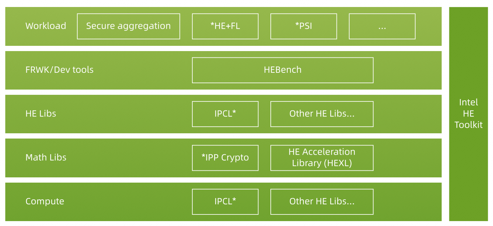

# Intel Homomorphic Encryption

## 项目位置链接

Intel HE Toolkit: https://github.com/intel/he-toolkit 

Intel HEXL: https://github.com/intel/hexl 

Intel Paillier Cryptosystem Library (IPCL): https://github.com/intel/pailliercryptolib 

HEBench: https://github.com/hebench 

## 归属社区SIG

云原生机密计算SIG

## 技术自身介绍

### 背景

同态加密是一种满足同态运算性质的加密技术，即在对密文进行特定形式的代数运算之后，得到的仍然是加密的结果，将其解密所得到的结果与对原始明文进行运算得出的结果一致。由于运算完全在密文上进行，同态加密可以提供极高的数据安全保证，其被广泛地应用于隐私保护计算、联邦学习和区块链等领域。

### 问题与挑战

虽然同态加密技术发展了许多年，但由于其技术复杂度高，对计算、存储和网络带宽资源要求高等原因，面临着开发、使用和部署门槛高的问题。为了解决上述问题，Intel提供了一系列工具套件和加速库，包括Intel HE Toolkit、Intel HE Acceleration Library （Intel HEXL）和Intel Paillier Cryptosystem Library（IPCL）。另一方面，同态加密技术正在经历标准化的过程，尽管涌现出了许许多多同态加密应用，但是缺乏一个公认的基准评价体系，针对这个问题，Intel向开源社区贡献了Homomorphic Encryption Benchmarking Framework（ HEBench）。

### 解决方案

如下图所示，Intel提供了对于同态加密技术的全栈式支持。在半同态加密方面，Intel提供了通过ISO认证的Paillier算法库IPCL，它使用了Intel IPP-Crypto库提供的AVX512IFMA指令集加速的能力，在最新的Intel Xeon平台上有优异的性能表现。在Leveled HE方面，依托于Intel Xeon平台最新的指令集加速以及FPGA的硬件加速能力，Intel HEXL封装了底层硬件细节，向上提供了加速的密码学运算接口供第三方同态加密库，如SEAL、Palisade和HELib使用。Intel HEXL在最新的Intel平台上同样采用了AVX512IFMA指令集加速伽罗华域上的大整数运算，并且可以根据CPU型号自动匹配最合适的加速实现，提供向后兼容功能。

围绕 HE 技术创新， Intel HE Toolkit 为社区和行业提供了一个用于HE 应用实验、开发和部署的平台。 Intel HE Toolkit目前提供示例内核和示例程序，这些示例程序演示了利用主流的同态加密库构建各种同态加密应用用于保护用户隐私数据的能力。 同时，Intel HE Toolkit通过使用Intel HEXL 加速库展示了使用最新的英特尔硬件功能发挥英特尔处理器在HE领域优势的最佳实践。

此外，HEBench为同态加密方案的开发者和用户提供了一个公允且标准的性能测试基准，旨在推动同态加密技术的演进和应用方案的创新。HEBench由三个部分组成：

1.	前端：包括测试框架和后端加载器。测试框架目前支持的运算有向量按元素的加法和乘法、向量点乘、矩阵乘法和逻辑回归推理，主要度量的指标是计算时延和吞吐量。
2.	适配层：提供了统一的C接口，桥接了前端的测试框架和后端具体的HE实现，使得后端开发者可以专注于HE各类算法的实现，只需要遵照接口定义就能很容易接入HEBench的测试框架。
3.	后端：支持开发者接入各类HE实现。目前HEBench开源项目中自带几个后端的参考实现，包括明文后端、SEAL后端和Palisade后端。

## 应用场景

同态加密天然适合云计算场景，因此最先在这一领域得以应用。用户希望借助云服务器强大的计算资源来进行复杂的计算，但又不希望暴露自己的私有数据。在同态加密进入这一领域之前，在信任云服务提供商不会泄露或者窃取用户数据的前提下，用户直接将明文交给云服务器进行计算，这样始终存在一定的安全风险。而有了同态加密之后，用户只需要将私有数据加密之后的密文传输到云端，在云端直接以密文形式参与计算，最终结果也是以密文的形式返回给用户，在用户本地进行解密。云计算在同态加密的加持下，安全性得到了充分的保证。

### 场景描述

在联邦学习的应用场景中，各参与方通过同态加密技术在保证各自数据隐私的情况下，共同参与训练机器学习模型，提高模型训练精度。在横向联邦学习中，各参与方在本地用各自的数据训练模型，将训练得到的模型参数加密上传参数服务器。参数服务器用Paillier等加法半同态加密技术聚合来自多方的模型参数，最后更新的模型参数仍然以密文形式发送给各参与方。利用同态加密技术可以防止攻击者从上传的模型参数中反推出用户的本地数据。在纵向联邦学习的隐私求交部分，同态加密也能发挥重要作用，从而保证在不暴露各方私有数据的情况下，求取用于联邦学习的训练数据的交集。

在区块链应用中，为了保护链上存证信息的隐私性，可以对这些数据进行同态加密，并将计算过程转化为同态运算过程，节点即可在无需获知明文数据的情况下实现密文计算。

### 应用效果

微众银行的联邦学习框架FATE采用了IPCL加速的Paillier方案，在第三代Xeon平台上的测试数据显示，对2048比特精度的整型数据进行模幂运算，相比于GMP方案有4. 7倍的性能提升。IPCL的应用极大地提高了用户使用联邦学习方案的效率，有效地减少了TCO。

蚂蚁集团的开源隐私计算框架 “隐语” 也正式接入 Intel IPCL 加速的 Paillier 方案，在第四代 Xeon 平台上的测试数据显示 IPCL 的应用显著提高了隐私计算的效率。