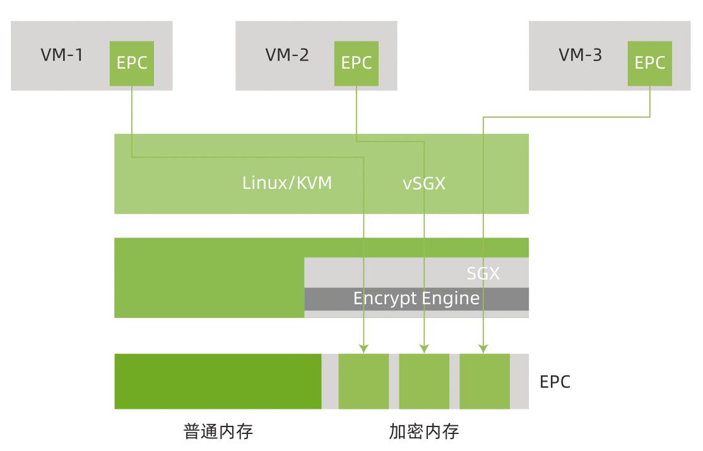

# Intel vSGX

## 项目位置链接

https://gitee.com/anolis/cloud-kernel.git

## 归属社区SIG

云原生机密计算SIG

## 技术自身介绍

### 背景

SGX 是Intel基于硬件TEE的技术实现方式之一，硬件提供飞地 (Enclave) 的构建能力，使运行在飞地中的用户代码数据具备加密性和完整性保护的特点。同时通过远程证明的自证手段，为用户提供SGX 飞地运行环境和软件组件的可信度。SGX作为成熟的硬件TEE技术，为联邦学习，多方计算，区块链，安全数据库等诸多场景中提供技术底座的支撑。

### 问题&挑战

目前云服务提供商售卖的计算资源以虚拟机，安全容器的形式最为常见。硬件的能力通过虚拟化的方式暴露给虚拟机和安全容器，以SGX为例，如何通过虚拟化的方式，能够在虚拟机和安全容器中透传SGX的硬件能力，让联邦学习，多方计算，区块链等业务形态方便易用的使用具备SGX功能的云上计算资源。

### 解决方案

SGX的能力主要针对用于飞地的专用内存EPC (Enclave Page Cache) 进行加密和完成行保护来实现。SGX的虚拟化实现一下三方面技术支撑：
1.	由虚拟机的CPUID 来枚举SGX的能力
2.	通过为虚拟机模拟构建EPC的区域使虚拟机感知SGX EPC
3.	捕捉虚拟机中SGX飞地构建的特殊指令，提供SGX飞地中附加功能的支持

### 技术介绍图片

### 结果

SGX虚拟化的支持已在Linux上游社区和龙蜥的5.10内核中支持。

## 用户情况

### 后续计划

SGX 2.0 中的EDMM 功能提供动态得为SGX 飞地增加EPC资源的能力，在后续的龙蜥版本中，通过龙蜥机密计算SIG，为用户提供该功能。
